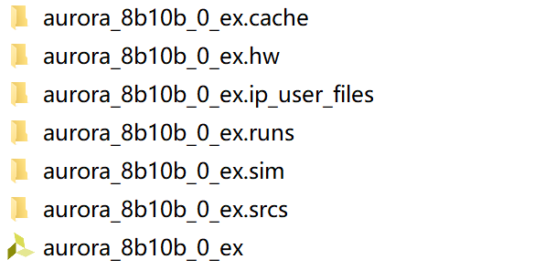
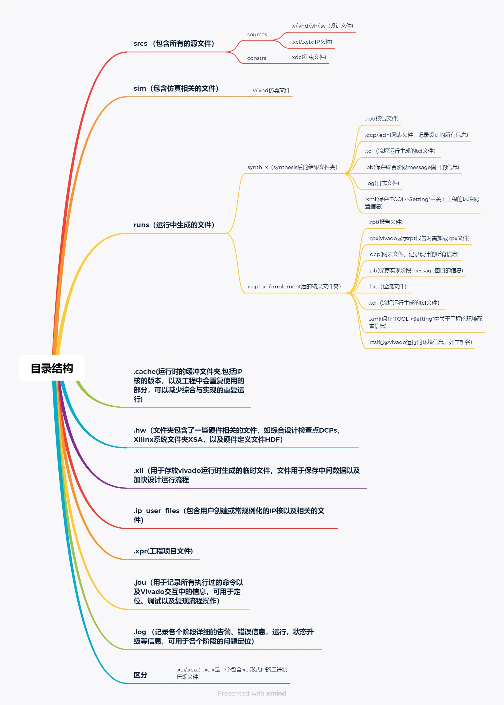

## EBAZ4025

* 矿板

[捡了个便宜的高级ZYNQ XC7Z010 开发板玩玩 ](https://whycan.com/t_2297.html)  <!-- more -->  

[xjtuecho/EBAZ4205: A 5$ Xilinx ZYNQ development board.](https://github.com/xjtuecho/EBAZ4205)

[【ZYNQ】EBAZ4205 ZYNQ 7010矿板改造开发板_ebaz4205 参数-CSDN博客](https://blog.csdn.net/Markus_xu/article/details/107752300)

https://github.com/Leungfung/ebaz4205_hw

https://github.com/ATmega8/EBAZ4205

https://github.com/Elrori/EBAZ4205/blob/master/xc7z010clg400pkg.txt

https://www.jianshu.com/p/b83c663ecaaa

## SG2625

[Zynq7000 系列 - 思林杰](https://www.smartgiant.com.cn/products/zynq7000-系列/)

[思灵杰zynq底板 - 立创开源硬件平台](https://oshwhub.com/xiaoqi_ks66/si-ling-jie-zynq)

[DouerGan/Xavier702010Board: SmartGiant's Xavier_zynq7020/7010 core board schematics, packaging, and baseboard reference design.](https://github.com/DouerGan/Xavier702010Board)

## Vivado工程目录

vivado工程文件目录，如下所示：

说明：

- project_name.cache：Vivado 软件的运行缓存
- project_name.hw：所有波形文件
- project_name.ip_user_files：用户关于 IP 的文件
- project_name.runs：编译与综合结果 ，impl_1 文件夹存取布线后结果
- project_name.sdk：SDK 环境代码，一般是 ZYNQ 设计中关于 PS 端的代码
- project_name.sim：仿真结果
- project_name.srcs：工程的源码、仿真文件与约束文件
- project_name.xpr：Vivado 工程启动文件

其中，project_name.xpr和project_name.srcs是两个最重要的文件和文件夹，其它文件夹都可以删除。

根据后缀名不同，文件内容也不同：

1. dcp文件，dcp文件是Design CheckPoint的缩写，中文翻译为“设计检查点”，它是一种加密的、压缩的二进制文件类型，包含了完整的设计信息，如实例化层次结构、资源使用情况、时序分析数据、约束等重要信息。在Vivado设计中，DCP文件通常用于在不同的Vivado工程或版本之间共享设计，并简化设计修改和迁移，或增量编译。
2. xdc文件，vivado的约束文件，比如时序约束和IO引脚约束。
3. xci文件，定制ip产生的文件，里面包含了定制的ip核的所有信息。
4. rpt文件，vivado每个过程结束输出的一个report文件，用来记录各个过程中的一些信息
5. .Xil文件，是Vivado用来降低运行时内存使用量的临时目录，该文件无法移动到其他位置。

